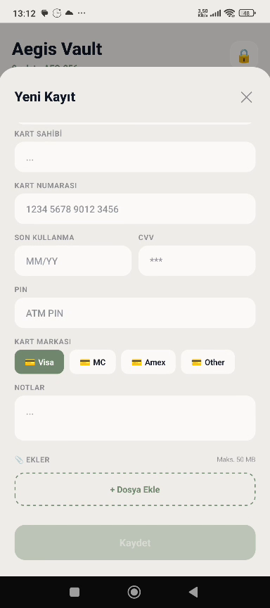
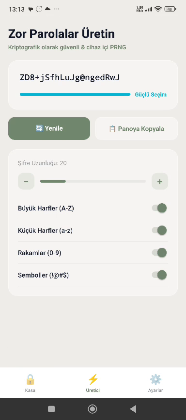
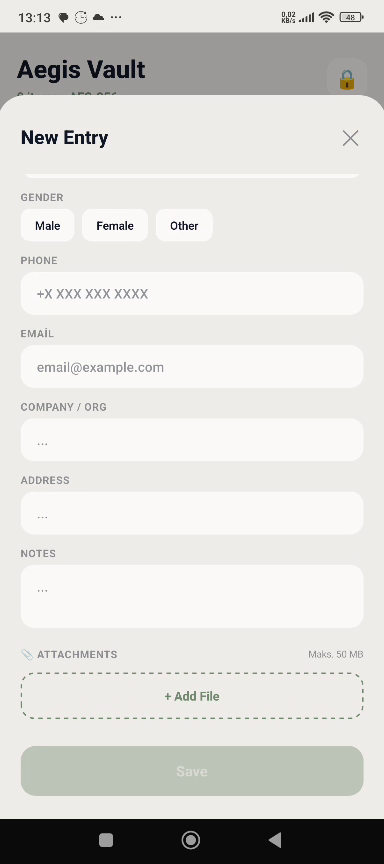

<p align="center">
  
</p>

<h1 align="center">🛡️ Aegis Vault Android</h1>

<p align="center">
  <strong>Secure. Private. Boundless.</strong><br>
  The next generation of open-source password management and digital security for Android.
</p>

<p align="center">
  
  
  
  
</p>

---

## 🌟 Overview

**Aegis Vault** is a high-performance, security-focused vault application designed to protect your most sensitive data. Built with **React Native** and powered by native Android security modules, it provides a premium user experience with ironclad security.

## ✨ Key Features

- **🔐 End-to-End Encryption:** Your data is encrypted locally using **AES-256-GCM**. No one else can access it.
- **🆔 Biometric Security:** Instant access with Fingerprint or Face ID integration.
- **🕒 TOTP Support:** Integrated 2FA authenticator for all your accounts.
- **🔍 Leak Detection:** Powered by _Have I Been Pwned_ API to check if your credentials are compromised.
- **☁️ Secure Cloud Sync:** Synchronize your vault across multiple devices with cloud encryption.
- **🗑️ Recycle Bin:** Advanced trash system with 30-day auto-cleanup.
- **🌍 Multi-language:** Premium localization for **English** and **Turkish**.

## 🛠️ Tech Stack

- **Frontend:** React Native 0.72+
- **Security:** Argon2 (Key Derivation), AES-256 (Encryption)
- **Networking:** Axios for secure API calls
- **State:** React Hooks & Context API
- **Design:** Modern Glassmorphism UI

## 📸 Screenshots

|                    Login Experience                    |                    Secure Vault                    |                     Security Center                      |
| :----------------------------------------------------: | :------------------------------------------------: | :------------------------------------------------------: |
|  |  |  |

## 🚀 Installation & Build

## 📦 F-Droid

- F-Droid metadata file: `com.aegisandroid.yml`
- The F-Droid build uses `subdir: android` and Gradle release APK output at `app/build/outputs/apk/release/app-release.apk`.
- In F-Droid CI, system package installation must run under `sudo:` (root stage), while dependency installation runs in `prebuild:`.

Example build flow used by metadata:

```yaml
sudo:
  - apt-get update
  - apt-get install -y npm
prebuild:
  - npm ci
```

### Prerequisites

- [Node.js](https://nodejs.org/) (LTS)
- [Android SDK](https://developer.android.com/studio) & ADB
- [React Native CLI](https://reactnative.dev/docs/environment-setup)

### Step-by-Step

1. **Clone the repo:**
   ```bash
   git clone https://github.com/hafgit99/AegisVaultAndroid_V.4.0.0.git
   cd AegisVaultAndroid_V.4.0.0
   ```
2. **Install modules:**
   ```bash
   npm install
   ```
3. **Launch on Android:**
   ```bash
   npx react-native run-android --mode release
   ```

### Secure Release Signing (Optional for local builds)

If release signing credentials are not provided, the project falls back to debug signing for local and CI release builds.
To strictly enforce release signing, pass `-PrequireReleaseSigning=true` to Gradle.

Set these environment variables before building release:

```bash
export RELEASE_STORE_FILE=/absolute/path/to/your-release.keystore
export RELEASE_STORE_PASSWORD=your_store_password
export RELEASE_KEY_ALIAS=your_key_alias
export RELEASE_KEY_PASSWORD=your_key_password
```

Windows PowerShell:

```powershell
$env:RELEASE_STORE_FILE="C:\\keys\\aegis-release.jks"
$env:RELEASE_STORE_PASSWORD="your_store_password"
$env:RELEASE_KEY_ALIAS="your_key_alias"
$env:RELEASE_KEY_PASSWORD="your_key_password"
```

Then build:

```bash
cd android
./gradlew assembleRelease -PrequireReleaseSigning=true
```

### Cloud Sync TLS Certificate Pinning

Cloud Sync now requires:

- `https://` endpoint URL
- Certificate pin in `sha256/<base64>` format

Get certificate pin from your server certificate:

```bash
openssl s_client -connect your-domain.com:443 -servername your-domain.com < /dev/null 2>/dev/null \
  | openssl x509 -pubkey -noout \
  | openssl pkey -pubin -outform der \
  | openssl dgst -sha256 -binary \
  | openssl enc -base64
```

Use result as:

```text
sha256/<generated_base64_value>
```

Tip: keep at least one backup pin ready for planned certificate rotation.

## ⚖️ License

Distributed under the **MIT License**. See `LICENSE` for more information.

---

<p align="center">
  Developed with excellence by <a href="https://github.com/hafgit99"><strong>hafgit99</strong></a>
</p>
