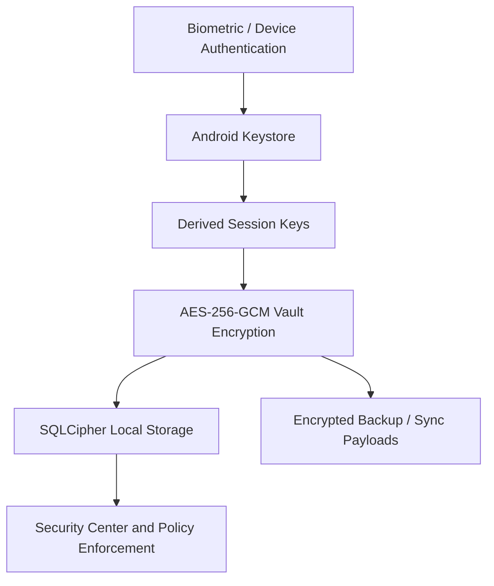

<p align="center">
  
</p>

<h1 align="center">Aegis Vault Android</h1>

<p align="center">
  Privacy-first Android password manager with local-first storage,
  hardware-backed protection, and optional end-to-end encrypted sync.
</p>

<p align="center">
  
  
  
  
  
</p>

<p align="center">
  <a href="#overview">Overview</a> |
  <a href="#core-capabilities">Core Capabilities</a> |
  <a href="#security-model">Security Model</a> |
  <a href="#screens">Screens</a> |
  <a href="#tech-stack">Tech Stack</a> |
  <a href="#getting-started">Getting Started</a> |
  <a href="#documentation">Documentation</a>
</p>

## Overview

**Aegis Vault Android** is a modern Android password manager built for users who want strong local control over their secrets. The project prioritizes secure on-device storage, biometric access, encrypted backup and restore flows, and a zero-knowledge sync architecture for multi-device use cases.

Unlike cloud-first password managers, Aegis Vault is designed around the idea that your vault should remain under your control by default. Sensitive data stays encrypted at rest, encryption keys are protected through Android security primitives, and optional sync transports do not require surrendering plaintext data to a server.

## Why This Project

- Local-first by default, with optional encrypted relay sync.
- Security-focused architecture built around device trust, biometric access, and encrypted persistence.
- Open source codebase with test automation, mutation testing, and security-oriented documentation.
- Designed as a product-grade Android app, not just a demo repository.

## Quick Facts

| Area | Details |
| --- | --- |
| Current version | `4.2.0` |
| Runtime | React Native `0.84.0`, React `19.2.3`, Hermes |
| Minimum Node.js | `18+` |
| Android support | Android 7.0+ |
| Local storage | SQLCipher via `@op-engineering/op-sqlite` |
| Crypto stack | AES-256-GCM, Argon2, Android Keystore |
| Test stack | Jest + Stryker mutation testing |

## Core Capabilities

### Vault and authentication

- Encrypted local vault storage with SQLCipher-backed persistence
- Biometric unlock support through `react-native-biometrics`
- Auto-lock controls and secure access policies
- Device trust and degraded-device policy handling

### Password and security workflows

- Password record management and local search
- Security Center analysis and vault health scoring
- Password history and brute-force protection flows
- Passkey and WebAuthn-oriented backend preparation

### Backup, recovery, and sync

- Encrypted export and import flows
- Structured backup and restore support
- Delta sync and relay-based synchronization
- Emergency access and recovery approval workflows

## Security Model

The application follows a pragmatic zero-knowledge direction:

- Vault data is encrypted before persistence.
- Sensitive material is protected with Android security primitives wherever possible.
- Backup flows use strong modern cryptography, including Argon2-based derivation paths.
- Sync is built around encrypted envelopes so the relay layer does not need plaintext access.



### Security highlights

- AES-256-GCM for authenticated encryption
- SQLCipher-backed encrypted local database
- Android Keystore integration
- Argon2 for backup and export derivation workflows
- Secure app-state and screen-protection controls

## Screens

<p align="center">
  
  
  
</p>

## Tech Stack

- React Native `0.84.0`
- React `19.2.3`
- TypeScript
- Hermes JavaScript engine
- `@op-engineering/op-sqlite` with SQLCipher enabled
- `react-native-quick-crypto`
- `react-native-argon2`
- `react-native-biometrics`
- Jest for automated tests
- Stryker for mutation testing

## Getting Started

### Prerequisites

- Node.js `18+`
- JDK `17`
- Android Studio with Android SDK tooling
- An Android emulator or a physical Android device

### Install and run

```bash
git clone https://github.com/hafgit99/AegisVaultAndroid_V.4.0.0.git
cd AegisVaultAndroid_V.4.0.0
npm install
npx react-native start
```

In a second terminal:

```bash
npx react-native run-android
```

### Useful scripts

```bash
npm test
npm run test:mutation
npm run android
npm run relay
```

## Quality and Testing

The repository includes both conventional automated tests and mutation testing to measure the strength of the test suite.

- Unit and integration coverage with Jest
- Mutation testing with Stryker
- Module-level hardening work across sync, passkey, backup, and security services
- Security-oriented documentation and release-readiness notes under `docs/`

## Documentation

### English

- [API Reference](docs/API_REFERENCE.md)
- [Security Architecture](docs/SECURITY_ARCHITECTURE.md)
- [Threat Model](docs/THREAT_MODEL.md)
- [User Guide](docs/USER_GUIDE_EN.md)
- [Release Notes 4.2.0](docs/RELEASE_NOTES_4.2.0.md)
- [Release Readiness](docs/RELEASE_READINESS.md)

### Turkish

- [Kullanici Kilavuzu](docs/KULLANICI_KILAVUZU_TR.md)
- [Cihaz Matrisi ve Saha Dogrulama](docs/CIHAZ_MATRISI_VE_SAHA_DOGRULAMA_TR.md)
- [Kapsamli Analiz Raporu](docs/KAPSAMLI_ANALIZ_RAPORU_V4_0_2_TR.md)
- [Oncelikli Guvenlik Iyilestirme Plani](docs/ONCELIKLI_GUVENLIK_IYILESTIRME_PLANI_TR.md)
- [Passkey WebAuthn ADR](docs/PASSKEY_WEBAUTHN_ADR_TR.md)

## Roadmap Direction

- Improve import and export interoperability
- Expand sync reliability and conflict handling
- Continue Security Center hardening
- Extend passkey and device-trust workflows
- Strengthen release engineering and field validation

## Contributing

Contributions are welcome, especially around:

- Android security hardening
- test quality and mutation coverage
- UX polish and accessibility
- documentation improvements
- interoperability and migration flows

Before opening a pull request, review the relevant docs in [docs](docs/), especially the security and release-readiness material.

## License

This project is distributed under the [MIT License](LICENSE).

<p align="center">
  <strong>Your data. Your device. Your control.</strong><br>
  Maintained by <a href="https://github.com/hafgit99">hafgit99</a>
</p>
