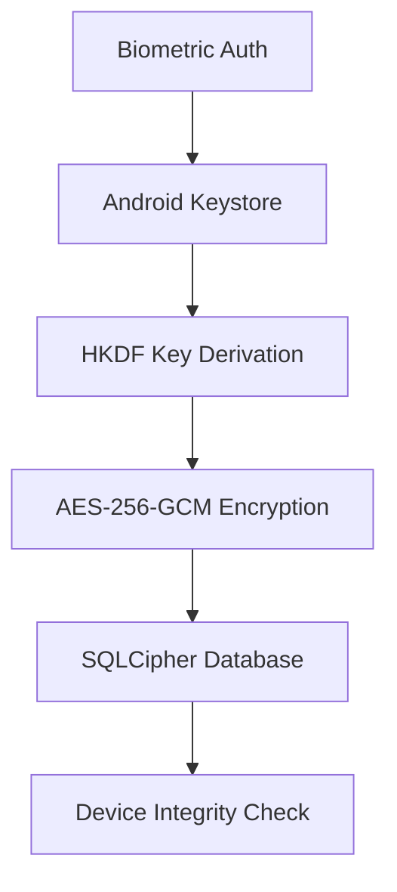

<p align="center">
  
</p>

<h1 align="center">🛡️ Aegis Vault Android</h1>

<p align="center">
  <strong>The Ultimate Privacy-First, E2E Encrypted Open Source Password Manager</strong><br>
  <em>Güçlü, tamamen güvenli ve yerel odaklı yeni nesil Android şifre yöneticisi</em>
</p>

<p align="center">
  
  
  
  
</p>

<p align="center">
  <a href="#overview">Overview</a> •
  <a href="#features">Features</a> •
  <a href="#security">Security</a> •
  <a href="#tech-stack">Tech Stack</a> •
  <a href="#getting-started">Getting Started</a> •
  <a href="#documentation">Documentation</a> •
  <a href="#roadmap">Roadmap</a>
</p>

---

## 🌟 Overview

**Aegis Vault Android** is a professional-grade, offline-first password manager designed for users who refuse to compromise on security and privacy. Built with a "Zero Knowledge" architecture, it ensures that your sensitive data never leaves your device unencrypted.

> [!IMPORTANT]
> **Why Aegis Vault?** While most password managers force you into the cloud, Aegis Vault empowers you with **full local control**. Secure your vault with hardware-backed encryption, SQLCipher-protected storage, and biometric authentication. Optional E2E encrypted relay synchronization is available for those who need multi-device connectivity without sacrificing privacy.

### 📊 Quick Facts (v4.2.0)

| Feature | Specification |
|:---|:---|
| **Version** | v4.2.0 (Build 420) |
| **Android Support** | 7.0+ (API 24) · Target SDK 35 |
| **Security Architecture** | AES-256-GCM + SQLCipher 4.5.6 |
| **JS Engine** | Hermes (High Performance) |
| **Test Coverage** | 160+ Passing Tests (Jest & Vitest) |
| **Total Size** | ~15.5 MB (Optimized) |
| **Language Support** | 🇹🇷 Turkish · 🇬🇧 English |

---

## 🚀 What's New in v4.2.0

- **Interoperability Excellence**: Full compatibility with Aegis Desktop v4.2.0.
- **Security Hardening**: Enhanced `FLAG_SECURE` implementation and stricter transport defaults.
- **Relay Sync v2**: Improved stability for zero-knowledge synchronization across devices.
- **Security Center**: Proactive risk analysis and health scoring for your vault entries.
- **Modernized UI**: Refined components for a smoother, premium user experience.

---

## 🛡️ The Aegis Philosophy: Security-First

Aegis Vault is not just another utility; it's a statement of digital sovereignty. In an era of data breaches and cloud vulnerability, we provide a refuge for your most sensitive credentials.

- **Zero Knowledge Architecture**: We don't have your keys, and we don't want them. Everything happens on your device.
- **Hardware-Backed Protection**: Keys are isolated in Secure Enclaves, invisible even to the operating system.
- **E2E Synchronization**: Encrypted with your own master key before leaving your device — our relay server never sees your data.
- **Pure Open Source**: Fully transparent, auditable, and community-driven. No hidden trackers. No telemetry.

---

## ✨ Features

### 🔐 Ironclad Vault & Cryptography
- **AES-256-GCM**: Industry-standard authenticated encryption for all records.
- **SQLCipher 4.5.6**: Military-grade full database encryption.
- **Android Keystore**: Private keys are stored in hardware-backed secure enclaves.
- **Argon2id**: State-of-the-art key derivation for exports and backups.

### 🔒 Privacy & Access
- **Biometric Unlock**: Seamless access via Fingerprint and Face Recognition.
- **Brute-force Shield**: Integrated attempt counters and lockout mechanisms.
- **Auto-Lock**: Configurable security timers (30s to 15m).
- **Snapshot Protection**: Prevents sensitive data from appearing in recent apps or screenshots.

### 🔄 Multi-Device Sync
- **E2E Encrypted Relay**: Sync between devices using our zero-knowledge relay architecture.
- **Conflict Resolution**: Smart merging of vault entries during synchronization.
- **Encrypted Local Backups**: Export your data securely to JSON format.

---

## 🛡️ Security Architecture



### Security Benchmarks

| Measure | Implementation |
|:---|:---|
| **Data Encryption** | AES-256-GCM (Authenticated) |
| **Database Security** | SQLCipher 4.5.6 (256-bit AES-CBC) |
| **Hardware Enclave** | Android Keystore |
| **Key Derivation** | HKDF (HMAC-SHA256) |
| **Hash Algorithm** | Argon2id |
| **Code Integrity** | ProGuard + R8 Obfuscation |

---

## 🛠️ Tech Stack

- **Core**: React Native 0.84 (TypeScript)
- **Engine**: Hermes JS
- **Crypto**: `react-native-quick-crypto`, `react-native-argon2`
- **Database**: `@op-engineering/op-sqlite` + SQLCipher
- **Auth**: `react-native-biometrics`
- **Networking**: OkHttp 4.12.0 (HTTPS-only)

---

## 🚀 Getting Started

### Prerequisites
- **Node.js** 18+
- **Android Studio** (SDK 35)
- **JDK** 17

### Installation
```bash
# Clone the repository
git clone https://github.com/hafgit99/AegisVaultAndroid_V.4.0.0.git
cd AegisVaultAndroid_V.4.0.0

# Install dependencies
npm install

# Start the development server
npx react-native start

# Run on Android
npx react-native run-android
```

---

## 📚 Documentation

### 📃 Release & Audit
- [Release Notes 4.2.0](docs/RELEASE_NOTES_4.0.2.md) (Updating soon)
- [Comprehensive Analysis Report (TR)](docs/KAPSAMLI_ANALIZ_RAPORU_V4_0_2_TR.md)
- [Security Architecture Deep Dive](docs/SECURITY_ARCHITECTURE.md)
- [Threat Model & Mitigations](docs/THREAT_MODEL.md)

### 🧪 Quality Assurance
- [Device Matrix Test Plan](docs/DEVICE_MATRIX_TEST_PLAN.md)
- [Field Test Operations (TR)](docs/GUNLUK_SAHA_TEST_OPERASYON_PLANI_TR.md)

---

## 🗺️ Roadmap

- [x] **v4.2.0**: Security Center & Relay Sync Stability
- [ ] **v4.3.0**: CSV/KDBX Import/Export Enhancements
- [ ] **v4.5.0**: Multi-language Expansion (DE, FR, ES)
- [ ] **v5.0.0**: Wear OS Companion & Browser Extension Bridge

---

## 🤝 Contributing

We welcome contributions! Please review our [Security Guidelines](docs/SECURITY_ARCHITECTURE.md) before submitting pull requests.

---

## 📄 License

Distributed under the **MIT License**. See [LICENSE](LICENSE) for details.

---

<p align="center">
  <strong>Aegis Vault Android</strong><br>
  <em>Your passwords. Your device. Your control.</em><br><br>
  Maintained with ❤️ by <a href="https://github.com/hafgit99"><strong>hafgit99</strong></a>
</p>