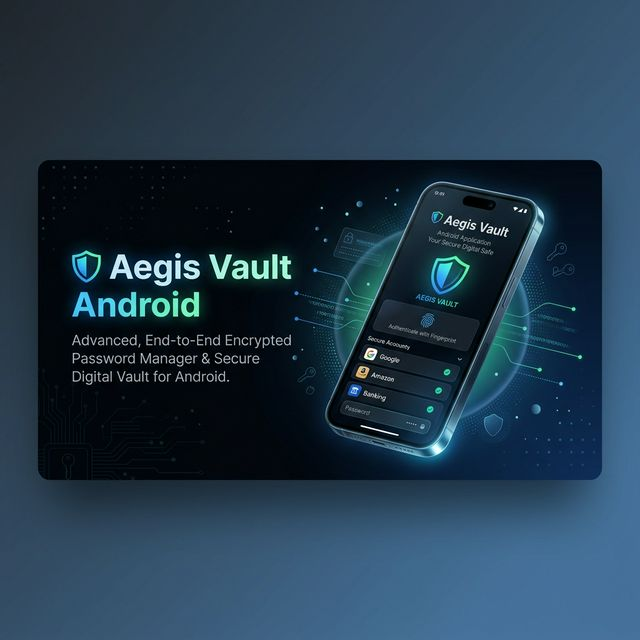
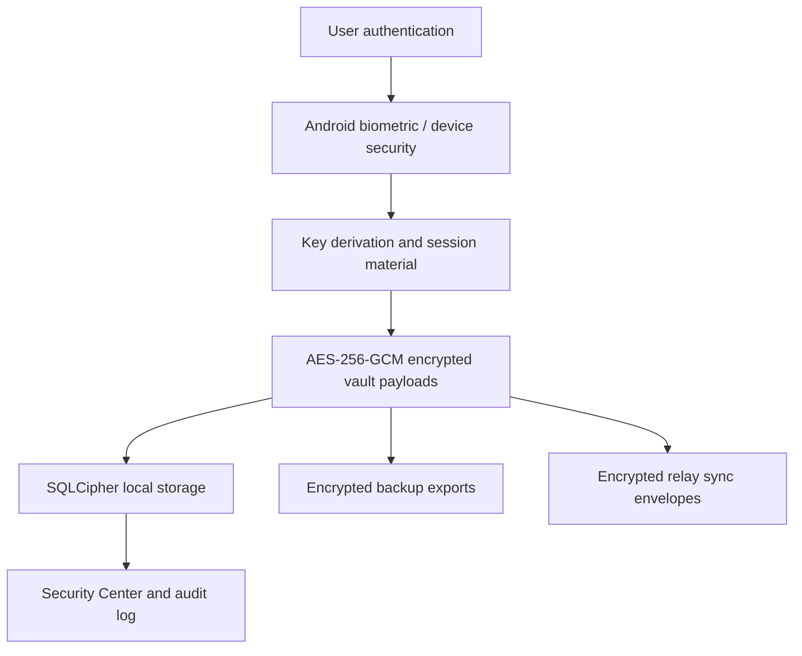

<p align="center">
  
</p>

<h1 align="center">Aegis Vault Android 5.0</h1>

<p align="center">
  Local-first Android password manager with encrypted vault storage, biometric access,
  desktop v5 interoperability, passkey workflows, and optional end-to-end encrypted sync.
</p>

<p align="center">
  
  
  
  
  
</p>

<p align="center">
  <a href="#what-is-new-in-50">What is New in 5.0</a> |
  <a href="#core-capabilities">Capabilities</a> |
  <a href="#security-model">Security</a> |
  <a href="#desktop-v5-compatibility">Desktop v5</a> |
  <a href="#build-and-run">Build</a> |
  <a href="#documentation">Docs</a>
</p>

## Overview

**Aegis Vault Android 5.0** is an offline-first password manager for Android. It is designed around a simple principle: secrets should remain encrypted, portable, and under the user's control by default.

The app combines SQLCipher-backed local storage, Android biometric access, encrypted backup/restore, local security scoring, passkey-oriented workflows, and optional encrypted relay sync. Version 5.0 focuses on aligning the Android app with the Aegis desktop v5 data model while improving release trust, auditability, and security-center visibility.

## What is New in 5.0

- **Desktop v5 canonical vault format**: Android exports and imports a canonical v5 JSON representation for migration, sync validation, and cross-platform compatibility.
- **Encrypted v5 backup envelope**: Encrypted exports can include the desktop-compatible canonical payload while preserving Android legacy item compatibility.
- **Crypto wallet and document records**: New category mapping keeps wallet and document entries portable across Android and desktop.
- **Desktop/browser pairing workspace**: Short-lived pairing records describe bridge capabilities without exposing app secrets.
- **Relay protocol and conflict metadata**: Sync envelopes now carry protocol versioning, device metadata, conflict summaries, and desktop-v5 compatibility markers.
- **Security Center improvements**: Local Watchtower-style checks cover weak passwords, reused passwords, missing 2FA/passkeys, aging credentials, sensitive sharing, and alias exposure.
- **Release provenance and SBOM**: Release metadata can be generated as CycloneDX SBOM plus a provenance manifest for audit-friendly distribution.
- **Bilingual and dark-mode polish**: Product surfaces continue to support Turkish/English text and dark-mode-safe UI choices.

## Latest Update

- **Encrypted backup export/import hardening**: Encrypted `.aegis` backups now save to the user-visible `Downloads/AegisVault` location on Android and use a byte-safe AES-256-GCM import path.
- **Release APK readiness**: The current signed release build is produced through `assembleRelease` with the Android release signing flow.
- **Coverage and quality gate cleanup**: The Jest coverage suite, TypeScript check, and ESLint pass cleanly after the latest security and compatibility fixes.
- **Relay compatibility restored**: The self-hosted relay entry point is available again for sync protocol and Play Integrity validation tests.

## Quick Facts

| Area | Details |
| --- | --- |
| Current version | `5.0.0` |
| Android package | `com.aegisandroid` |
| Runtime | React Native `0.84.0`, React `19.2.3`, Hermes |
| Language | TypeScript |
| State management | Zustand |
| Local database | SQLCipher via `@op-engineering/op-sqlite` |
| Cryptography | AES-256-GCM, Argon2, Android Keystore integrations |
| Authentication | Biometric unlock and device-bound flows |
| Testing | Jest, TypeScript checks, ESLint, Stryker mutation testing |
| Release trust | SBOM and provenance generation scripts |

## Core Capabilities

### Vault management

- Encrypted local vault records for logins, cards, identities, notes, Wi-Fi, passkeys, crypto wallets, and documents.
- Fast local search and category filtering.
- Favorites, trash/restore flows, attachments, password history, and audit logging.
- Dark-mode-aware and bilingual UI surfaces.

### Authentication and hardening

- Biometric-gated vault unlock.
- Auto-lock and clipboard-clear controls.
- Brute-force protection and security audit history.
- Device trust and security policy controls.
- Local password generator with bias-resistant generation logic.

### Security Center

- Local vault health score.
- Weak password and reused password detection.
- Missing 2FA/passkey analysis.
- Aging credential and sensitive sharing review.
- Alias exposure and high-risk account triage.

### Backup, import, and migration

- Encrypted backup export/import.
- Plain JSON/CSV export paths with explicit risk messaging.
- Desktop v5 canonical JSON export.
- Desktop encrypted import compatibility layer.
- Release-friendly provenance and SBOM generation.

### Sync and ecosystem bridge

- Optional end-to-end encrypted relay sync.
- Conflict metadata and sync envelope validation.
- Desktop/browser pairing records with capability negotiation.
- Self-hosted relay support with HTTPS and certificate pin expectations.

## Security Model

Aegis Vault Android follows a pragmatic zero-knowledge architecture:

- Vault secrets are encrypted before they are persisted.
- Local database access is protected through SQLCipher.
- Backup and sync payloads are encrypted before leaving the device.
- Relay infrastructure is treated as an untrusted transport layer.
- Security-sensitive activity is recorded in a local audit log.
- Release artifacts can be accompanied by SBOM and provenance files.



### Quality gates

The project uses layered quality checks:

- `npx tsc --noEmit` for TypeScript correctness.
- `npm run lint` for static analysis.
- `npm test` for Jest regression coverage.
- `npm run test:mutation` for Stryker mutation testing.
- Targeted security modules are maintained with a goal of **70%+ mutation score**.

> Note: repository-wide mutation score depends on the selected Stryker configuration and included files. Security-critical modules are tracked separately so hardening work remains measurable.

## Desktop v5 Compatibility

Version 5.0 introduces a shared interoperability layer for Android and desktop:

- Canonical schema version: `5.0.0`.
- Export kind: `aegis-vault-canonical`.
- Compatibility marker: `desktop-v5-canonical`.
- Bridge pairing kind: `aegis-desktop-bridge-pairing`.
- Supported portable categories include login, card, identity, note, Wi-Fi, passkey, crypto wallet, and document.

Useful tests:

```bash
npx jest --no-coverage --runInBand --testTimeout=30000 --runTestsByPath __tests__/CanonicalVaultSchema.test.ts __tests__/BackupModule.test.ts
npx jest --no-coverage --runInBand --testTimeout=30000 --runTestsByPath __tests__/SyncEnvelope.test.ts __tests__/RelayProtocol.test.ts __tests__/BrowserPairingService.test.ts
```

## Screens

<p align="center">
  
  
  
</p>

## Build and Run

### Requirements

- Node.js `18+`
- JDK `17`
- Android Studio and Android SDK tooling
- Android emulator or physical Android device

### Development build

```bash
git clone https://github.com/hafgit99/AegisVaultAndroid_V.4.0.0.git
cd AegisVaultAndroid_V.4.0.0
npm install
npx react-native start
```

In a second terminal:

```bash
npx react-native run-android
```

### Release build

Use environment variables for signing secrets. Do not commit passwords, keystores, or generated secret files.

```powershell
$env:RELEASE_STORE_FILE="F:\path\to\aegis-release.jks"
$env:RELEASE_STORE_PASSWORD="***"
$env:RELEASE_KEY_ALIAS="aegis-release"
$env:RELEASE_KEY_PASSWORD="***"
cd android
.\gradlew.bat assembleRelease
```

### Common scripts

```bash
npm run lint
npx tsc --noEmit
npm test
npm run test:mutation
npm run relay
npm run release:provenance
```

## Release Trust Chain

The repository includes a release metadata generator:

```bash
npm run release:provenance
```

It writes:

- `release-artifacts/aegis-android-sbom.cdx.json`
- `release-artifacts/aegis-android-provenance.json`

The provenance file records package version, source metadata, build commands, material hashes, and discovered APK/AAB artifacts.

## Documentation

### Product and user documentation

- [English User Guide](docs/USER_GUIDE_EN.md)
- [Turkish User Guide](docs/KULLANICI_KILAVUZU_TR.md)
- [API Reference](docs/API_REFERENCE.md)
- [Documentation Index](docs/README.md)

### Security and release documentation

- [Security Architecture](docs/SECURITY_ARCHITECTURE.md)
- [Threat Model](docs/THREAT_MODEL.md)
- [Release Readiness](docs/RELEASE_READINESS.md)
- [Release Notes 5.0.0](docs/RELEASE_NOTES_5.0.0.md)
- [Passkey WebAuthn ADR](docs/PASSKEY_WEBAUTHN_ADR_TR.md)
- [Passkey Backend Checklist](docs/PASSKEY_BACKEND_IMPLEMENTATION_CHECKLIST_TR.md)
- [Device Matrix Test Plan](docs/DEVICE_MATRIX_TEST_PLAN.md)

## Roadmap

- Complete wider real-device validation for passkey, sync, sharing, pairing, and autofill flows.
- Expand Security Center with stronger breach-intelligence workflows while preserving offline-first behavior.
- Continue desktop/browser bridge hardening.
- Improve reproducible release evidence and external audit readiness.
- Keep mutation testing focused on security-critical modules.

## Responsible Disclosure

Please report vulnerabilities privately. See [SECURITY.md](SECURITY.md) for supported versions and reporting expectations.

## License

This project is distributed under the [MIT License](LICENSE).

<p align="center">
  <strong>Your vault. Your device. Your control.</strong><br>
  Maintained by <a href="https://github.com/hafgit99">hafgit99</a>
</p>
